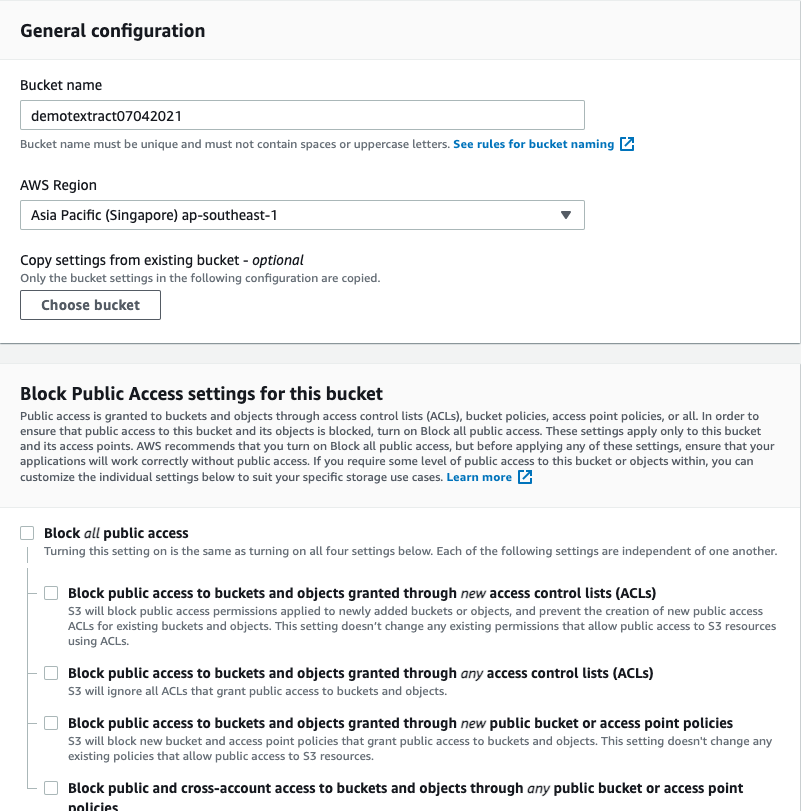
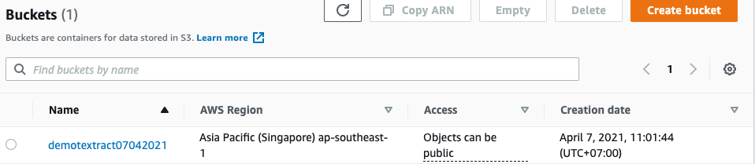
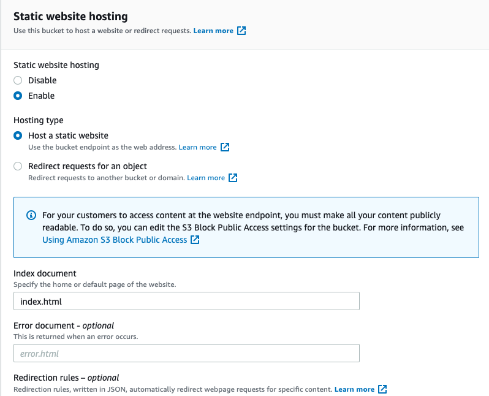
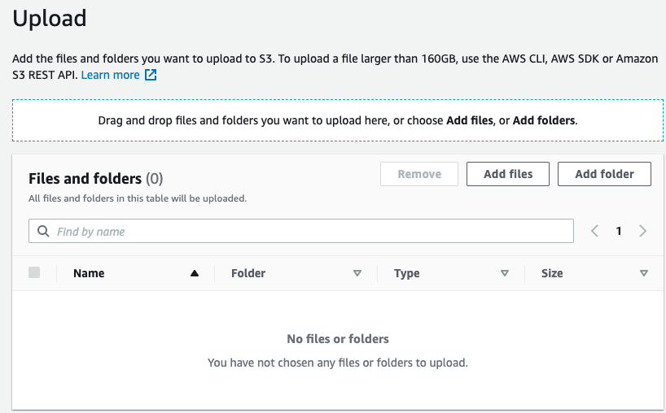
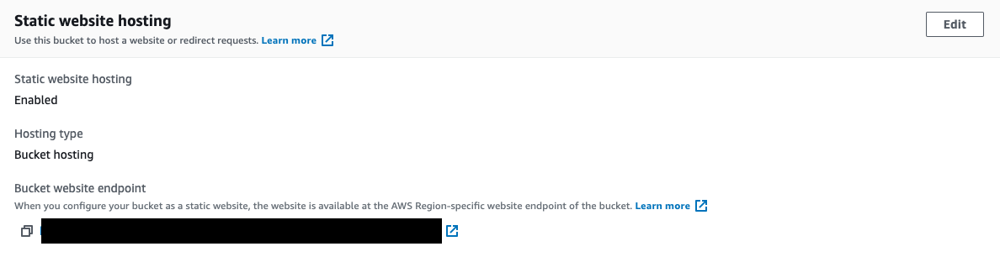

# VALIDASI DOKUMEN
## Membuat document checking atau validasi dokumen menggunakan Amazon Textract

1. Buat Lambda Function manggunakan runtime Python 3.8 dan gunakan coding berikut ini:

```
import json
import boto3
import base64


def lambda_handler(event, context):
    eventBody = json.loads(json.dumps(event))['body']
    imageBase64 = json.loads(eventBody)['Image']
    # Amazon Textract client
    textract = boto3.client('textract')
    
    # Call Amazon Textract
    response = textract.detect_document_text(
        Document={
            'Bytes': base64.b64decode(imageBase64)
        })

    detectedText = ''
    doctype = 'UNKNOWN'

    # Print detected text
    for item in response['Blocks']:
        if item['BlockType'] == 'LINE':
            detectedText += item['Text'] + '|'   
    
    # get doc type from detected text
    if (detectedText.lower().find("nik") != -1 and detectedText.lower().find("agama") != -1 and detectedText.lower().find("kewarganegaraan") != -1 and detectedText.lower().find("darah") != -1):
        doctype = "KTP"
    if (detectedText.lower().find("surat izin mengemudi") != -1 and detectedText.lower().find("driving license") != -1 ):
        doctype = "SIM"
            
    result= {
        'document_type':doctype,
        'detected_text':detectedText
    }

    return {
        'statusCode': 200,
        'headers': {
        'Access-Control-Allow-Headers': 'Content-Type',
        'Access-Control-Allow-Origin': '*',
        'Access-Control-Allow-Methods': 'OPTIONS,POST,GET'
        },
        'body': json.dumps(result)
    }
```

2. Dalam Lambda Editor, pilih menu "Configuration -> Permission" dan klik pada Role Name di bagian Execution Role, akan terbuka window baru untuk menu IAM

3. Di menu IAM, klik tombol "Attach Policies" dan tambahkan "AmazonTextractFullAccess" Policy

4. Buat API Gateway lambda proxy, enable CORS dan deploy

Masuk ke halaman API Gateway 

5. Buat S3 bucket dan enable website hosting

Masuk ke halaman S3, kemudian pilih `create bucket`. Isi nama bucket kemudian uncheck block public access 



Klik `create` 



Untuk enable webhosting di S3, klik nama bucket, kemudan pilih tab `Properties`. Scroll ke bawah di bagian `Static website hosting` kemudian pilih `Edit`

Pada `Static website hosting` pilih `enable`, kemudian `Hosting Type` pilih `Host a static website`, untuk `Index document` isi `index.html`



Kalau sudah, klik `Save changes`

6. donwload code html, js dan deploy ke S3

Untuk contoh code ada di `code` folder, download terlebih dahulu file yang ada di folder tersebut.

Pada halaman S3, pilih bucket yang sudah kita buat sebelumnya, kemudian klik `Upload` code yang sudah kita download.



Klik tombol `Upload` untuk jika sudah selesai.

7. Testing website

Setelah melakukan setup, kita bisa mencoba website yang sudah kita buat dengan mengakses ke end point static website di S3 kita. Untuk mengetahui end point website, kita bisa masuk ke bucket kita, kemudian pilih tab `Properties` lalu scroll ke bawah untuk website end point kita.




###End