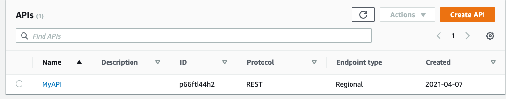
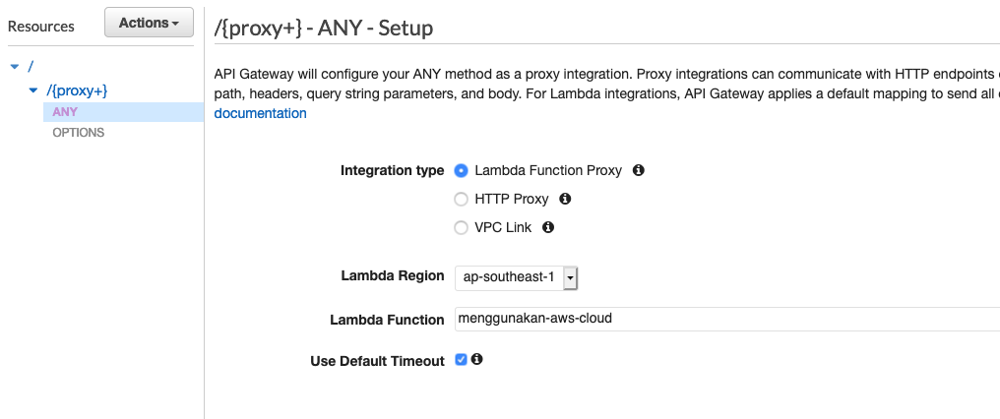
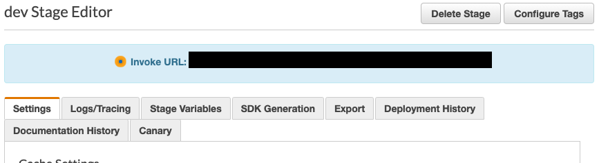
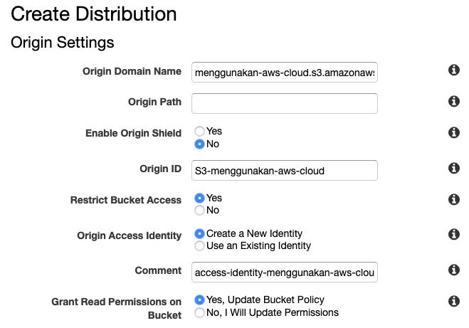
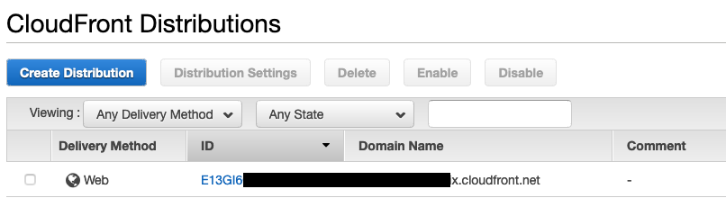

# VALIDASI DOKUMEN
## Membuat document checking atau validasi dokumen menggunakan Amazon Textract

1. Buat Lambda Function menggunakan runtime Python 3.8 dan gunakan coding berikut ini:

```
import json
import boto3
import base64


def lambda_handler(event, context):
    eventBody = json.loads(json.dumps(event))['body']
    imageBase64 = json.loads(eventBody)['Image']
    # Amazon Textract client
    textract = boto3.client('textract')
    
    # Call Amazon Textract
    response = textract.detect_document_text(
        Document={
            'Bytes': base64.b64decode(imageBase64)
        })

    detectedText = ''
    doctype = 'UNKNOWN'

    # Print detected text
    for item in response['Blocks']:
        if item['BlockType'] == 'LINE':
            detectedText += item['Text'] + '|'   
    
    # get doc type from detected text, please modify based on your needs
    if (detectedText.lower().find("nik") != -1 and detectedText.lower().find("agama") != -1 and detectedText.lower().find("lahir") != -1 and detectedText.lower().find("darah") != -1):
        doctype = "KTP"
    if (detectedText.lower().find("surat izin mengemudi") != -1 and detectedText.lower().find("driving license") != -1 ):
        doctype = "SIM"
            
    result= {
        'document_type':doctype,
        'detected_text':detectedText
    }

    return {
        'statusCode': 200,
        'headers': {
        'Access-Control-Allow-Headers': 'Content-Type',
        'Access-Control-Allow-Origin': '*',
        'Access-Control-Allow-Methods': 'OPTIONS,POST,GET'
        },
        'body': json.dumps(result)
    }
```

2. Dalam Lambda Editor, pilih menu `Configuration` -> `Permission` dan klik pada `Role Name` di bagian `Execution Role`, akan terbuka window baru untuk menu IAM

3. Di menu IAM, klik tombol `Attach Policies` dan tambahkan "AmazonTextractFullAccess" Policy

4. Buat API Gateway

Masuk ke halaman API Gateway kemudian pilih `Create API` -> `REST API` -> `Build`. 

Pilih `New API`. Isi nama API dengan `Endpoint Type` Regional (jika anda ingin menggunakan Cloudfront, pilih yang `Edge Optimized`), lalu klik `Create API`. 

Masuk ke dashboard API Gateway, kemudian pilih API yang tadi kita buat. 

Kemudian, pada jendela di sebelah kiri, pilih Resources. Di Bagian Resources, pilih Create Resources

centang pada bagian `Configure as proxy resource` dan `Enable API Gateway CORS` kemudian `Create Resource`. 



Pilih Lambda Function yang kita buat di step 1 lalu klik `Save`



Untuk melakukan deployment API yang sudah kita buat, pilih `Actions` lalu `Deploy API`

Deployment stage pilih `New Stage`

Stage name dev lalu klik Deploy. Jika sukses maka kita akan mendapatkan URL API Gateway kita. Catat Invoke URL dari API Gateway ini karena kita akan membutuhkannya nanti.



5. Jika anda ingin menggunakan Cloudfront, skip langkah nomor 6 dan lanjutkan langsung ke langkah nomor 7.

6. Buat S3 bucket dan enable website hosting

Masuk ke halaman S3, kemudian pilih `create bucket`. Isi nama bucket kemudian uncheck block public access 


Klik `create` 


Untuk enable webhosting di S3, klik nama bucket, kemudan pilih tab `Properties`. Scroll ke bawah di bagian `Static website hosting` kemudian pilih `Edit`

Pada `Static website hosting` pilih `enable`, kemudian `Hosting Type` pilih `Host a static website`, untuk `Index document` isi `index.html`


Kalau sudah, klik `Save changes`

7. Buat S3 bucket (hanya jika anda ingin menggunakan Cloudfront dan tidak ingin membuka akses publik ke S3 bucket anda)

Masuk ke halaman S3, kemudian pilih `create bucket`. Isi nama bucket kemudian create bucket.

8. donwload code html, js dan deploy ke S3

Untuk contoh code ada di `code` folder, download terlebih dahulu file yang ada di folder tersebut.

Rubah End Point dari API Gateway yang ada di javascript file di `js/script.js` dan tambahkan /proxy dibelakang API Gateway URL tersebut sehingga formatnya menjadi seperti ini: `https://xxxxxxx.execute-api.ap-southeast-1.amazonaws.com/dev/proxy`

Pada halaman S3, pilih bucket yang sudah kita buat sebelumnya, kemudian klik `Upload` isi dari folder code (file index.html dan folder `assets`) yang sudah kita download.


Klik tombol `Upload` untuk jika sudah selesai.

9. Konfigurasi Cloudfront

Masuk ke halaman Cloudfront dan klik pada `Create Distribution`. Pada bagian `Origin Domain Name` pilih S3 bucket yang sudah kita buat.
Pada bagian `Restrict Bucket Access` kita pilih `Yes` kemudian pada bagian `Origin Access Identity` kita pilih `Create a New Identity` dan pada bagian `Grant Read Permissions on Bucket` kita pilih `Yes, Update Bucket Policy`. Kemudian pada bagian `Default Root Object` kita isi dengan `index.html`.lalu kita klik `Create Distribution`. Kita tunggu sampai statusnya berubah dari In Progress menjadi Deployed.



11. Testing website

Setelah melakukan setup, kita bisa mencoba website yang sudah kita buat dengan mengakses ke end point static website di S3 kita atau Cloudfront URL yang sudah kita configure. Untuk mengetahui end point website kalau kita menggunakan S3 web hosting, kita bisa masuk ke bucket kita, kemudian pilih tab `Properties` lalu scroll ke bawah untuk website end point kita.


Untuk URL dari Cloudfront, kita bisa lihat di bagian `Domain Name` pada menu Cloudfront.



12. Coba upload berbagai tipe dokumen dan cek hasilnya.
