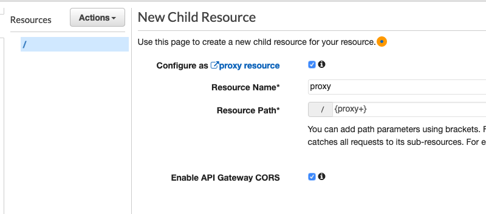

# VALIDASI DOKUMEN
## Membuat simple document checking atau validasi dokumen menggunakan Amazon Textract

1. Buat Lambda Function menggunakan runtime Python 3.8 dan gunakan coding berikut ini:

```
import json
import boto3
import base64

def get_kv_map(imageBase64):
    
    # Amazon Textract client
    textract = boto3.client('textract')
    # process using image bytes
    client = boto3.client('textract')
    response = client.analyze_document(Document={'Bytes': base64.b64decode(imageBase64)}, FeatureTypes=['FORMS'])

    # Get the text blocks
    blocks=response['Blocks']
    

    # get key and value maps
    key_map = {}
    value_map = {}
    block_map = {}
    for block in blocks:
        block_id = block['Id']
        block_map[block_id] = block
        if block['BlockType'] == "KEY_VALUE_SET":
            if 'KEY' in block['EntityTypes']:
                key_map[block_id] = block
            else:
                value_map[block_id] = block

    return key_map, value_map, block_map


def get_kv_relationship(key_map, value_map, block_map):
    kvs = {}
    for block_id, key_block in key_map.items():
        value_block = find_value_block(key_block, value_map)
        key = get_text(key_block, block_map)
        val = get_text(value_block, block_map)
        kvs[key] = val
    return kvs
    

def find_value_block(key_block, value_map):
    for relationship in key_block['Relationships']:
        if relationship['Type'] == 'VALUE':
            for value_id in relationship['Ids']:
                value_block = value_map[value_id]
    return value_block

def get_text(result, blocks_map):
    text = ''
    if 'Relationships' in result:
        for relationship in result['Relationships']:
            if relationship['Type'] == 'CHILD':
                for child_id in relationship['Ids']:
                    word = blocks_map[child_id]
                    if word['BlockType'] == 'WORD':
                        text += word['Text'] + ' '
                    if word['BlockType'] == 'SELECTION_ELEMENT':
                        if word['SelectionStatus'] == 'SELECTED':
                            text += 'X '    

                                
    return text
    
def check_doc(detectedText):
    
    doctype = "UNKNOWN"
    detectedText = json.dumps(detectedText)
    # get doc type from detected text, please modify based on your needs
    if (detectedText.lower().find("nik") != -1 and detectedText.lower().find("agama") != -1 and detectedText.lower().find("lahir") != -1 and detectedText.lower().find("darah") != -1):
        doctype = "KTP"
    if (detectedText.lower().find("sim") != -1 and detectedText.lower().find("tingg") != -1 ):
        doctype = "SIM"
    
    return(doctype)
        

def lambda_handler(event, context):
    eventBody = json.loads(json.dumps(event))['body']
    imageBase64 = json.loads(eventBody)['Image']

    # THIS ONE FOR KEY VALUE PAIR
    key_map, value_map, block_map = get_kv_map(imageBase64)

    # Get Key Value relationship
    kvs = get_kv_relationship(key_map, value_map, block_map)
    
    doctype = check_doc(kvs)
    
    result= {
        'document_type':doctype,
        'detected_text':kvs
    }
    
    return {
        'statusCode': 200,
        'headers': {
        'Access-Control-Allow-Headers': 'Content-Type',
        'Access-Control-Allow-Origin': '*',
        'Access-Control-Allow-Methods': 'OPTIONS,POST,GET'
        },
        'body': json.dumps(result)
    }

```

2. Dalam Lambda Editor, pilih menu `Configuration` -> `Permission` dan klik pada `Role Name` di bagian `Execution Role`, akan terbuka window baru untuk menu IAM

3. Di menu IAM, klik tombol `Attach Policies` dan tambahkan "AmazonTextractFullAccess" Policy

4. Buat API Gateway

Masuk ke halaman API Gateway kemudian pilih `Create API` -> `REST API` -> `Build`. 

Pilih `New API`. Isi nama API dengan `Endpoint Type` Regional (jika anda ingin menggunakan Cloudfront, pilih yang `Edge Optimized`), lalu klik `Create API`. 

Masuk ke dashboard API Gateway, kemudian pilih API yang tadi kita buat. 

Kemudian, pada jendela di sebelah kiri, pilih Resources. Di Bagian Resources, pilih Create Resources

centang pada bagian `Configure as proxy resource` dan `Enable API Gateway CORS` kemudian `Create Resource`. 



Pilih Lambda Function yang kita buat di step 1 lalu klik `Save`


Untuk melakukan deployment API yang sudah kita buat, pilih `Actions` lalu `Deploy API`

Deployment stage pilih `New Stage`

Stage name dev lalu klik Deploy. Jika sukses maka kita akan mendapatkan URL API Gateway kita. Catat Invoke URL dari API Gateway ini karena kita akan membutuhkannya nanti.


5. Donwload code html, js dan css yang diperlukan

Untuk contoh code ada di `code` folder, download terlebih dahulu file yang ada di folder tersebut.

Rubah End Point dari API Gateway yang ada di javascript file di `js/docs.js` dan tambahkan /proxy dibelakang API Gateway URL tersebut sehingga formatnya menjadi seperti ini: `https://xxxxxxx.execute-api.ap-southeast-1.amazonaws.com/dev/proxy`

6. ZIP semua file tersebut (index.html beserta folder assets)

7. Buka menu Amplify, Pilih menu "Host your web app" lalu pilih bagian "Deploy without Git provider". Upload file yang sudah di zip tadi dan deploy ke Amplify.

8. Testing website

Setelah melakukan setup, kita bisa mencoba website yang sudah kita buat dengan mengakses ke end point Amplify web app.

9. Coba upload berbagai tipe dokumen dan cek hasilnya.
